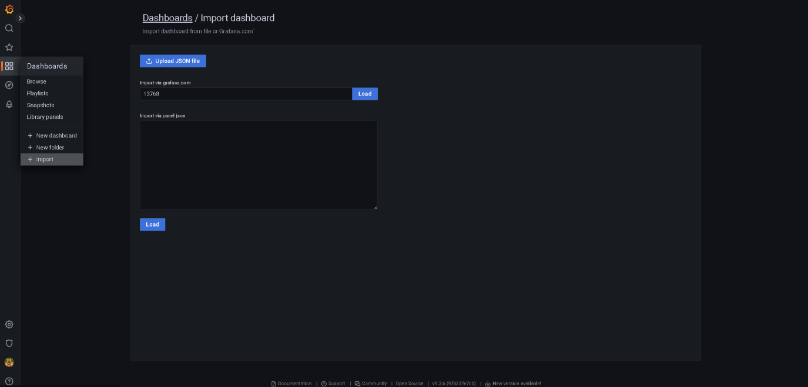
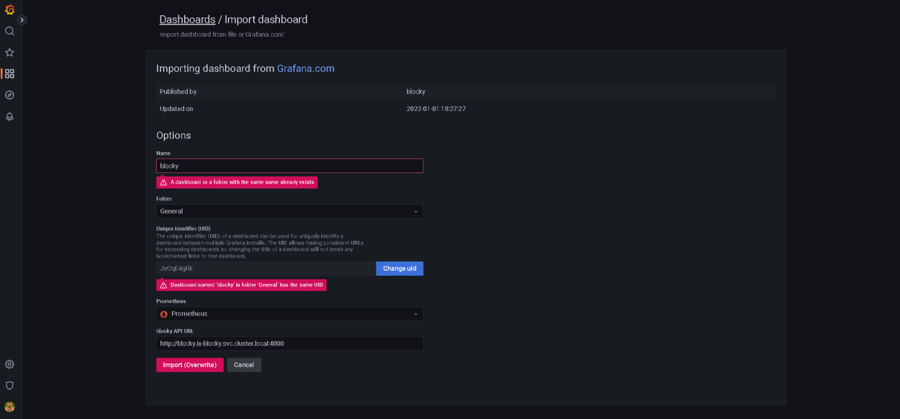
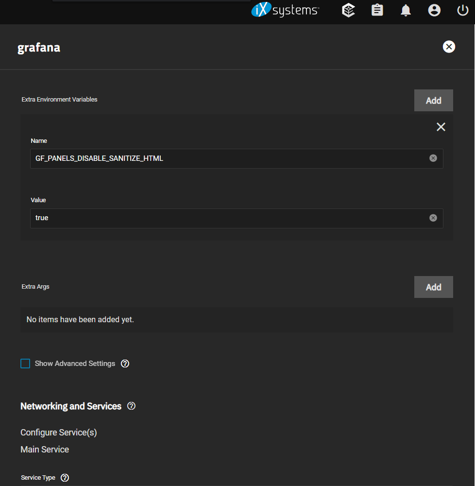
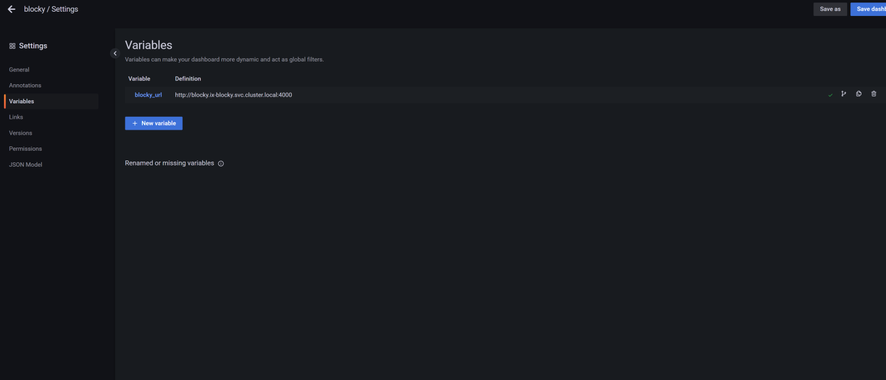

# Set up Blocky's dashboard in Grafana

*Originally discussed [here](https://discord.com/channels/830763548678291466/1084135564925751458), in TrueCharts discord.*

**If you haven't set up Prometheus and grafana, go to the [Prometheus and Grafana mini-guide].**

## Import the dashboard and link to blocky's API

Otherwise, if you already have grafana and prometheus running, just import dashboard 13768 in grafana:

Then set your prometheus instance as source, and your kubernetes dns and port as API address; mine is `http://blocky.ix-blocky.svc.cluster.local:4000`. (The red messages in the image are because I already have it setup and it's screaming in fear of being overwritten.) 

## Enable blocking on/off buttons

**NOTE: Even if it shows up, the on/off button might not be working for now if you access your dashboard through https, since grafana would expect the API to also be on a `https` address – a fix (including ingress for the API) might be coming; see [here](https://discord.com/channels/830763548678291466/830763549156573222/1084215712438026281).**

For the On/Off button to work, as pointed out [here](https://discord.com/channels/830763548678291466/920795329132126249/1037153676759941360), you need to set up the environment variable `GF_PANELS_DISABLE_SANITIZE_HTML` in Grafana to `True`.

That should be it. But, if the button is still not working, according to [this](https://discord.com/channels/830763548678291466/830763549156573222/1084214387386097674), make sure the `blocky_url` is also set to your kubernetes domain name ([source](https://discord.com/channels/830763548678291466/830763549156573222/1084214387386097674)). This should already be set if you followed the previous steps. Check in the dashboard's `Settings >> Variables` (if you don't see the settings' navigation panel to the left, you might have to press a small arrow pointing to the right, near the top, next to the `General` title).

